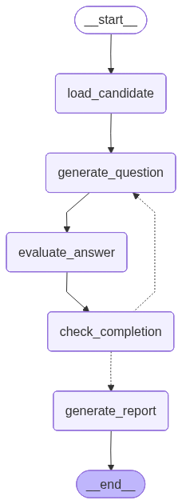

#  AI-Powered Voice Interview System

A modern **FastAPI-based backend** that conducts intelligent, voice-enabled technical interviews using AI. It dynamically generates questions, evaluates answers in real-time, and produces professional hiring reports.

---

##  Features

- **Voice-First Interview Experience** — Record answers via microphone
- **Dynamic Question Generation** — AI tailors questions based on role, skills & previous answers
- **Real-time Answer Evaluation** — 5-metric scoring (Technical Accuracy, Communication, Confidence, etc.)
- **Adaptive Difficulty** — Automatically adjusts question difficulty
- **Professional AI Reports** — Detailed evaluation with strengths, improvements & hiring recommendation
- **Full Conversation History** — Every question and answer is stored
- **Robust Fallback System** — Works even without API keys using powerful mock LLM

---

## Tech Stack

- **Backend**: FastAPI
- **Workflow Orchestration**: LangGraph
- **LLM**: Groq (Llama-3.3-70B) + Strong Mock LLM fallback
- **Speech-to-Text**: Sarvam AI (`saarika:v2.5`)
- **Text-to-Speech**: TTS Service
- **Database**: SQLite
- **ORM**: SQLAlchemy

---

##  Project Structure

```bash
backend/
├── app/
│   ├── api/endpoints/          # FastAPI routes
│   ├── db/                     # Database models
│   ├── interview_workflow/     # LangGraph + Agents
│   ├── services/               # LLM, STT, TTS
│   └── config.py
├── main.py
├── .env
├── pyproject.toml
└── README.md
```

---

##  Installation & Setup

### 1. Clone the Repository
```bash
git clone https://github.com/Nandhuincede/interview.git
cd backend
```

### 2. Create & Activate Virtual Environment
```bash
python -m venv venv
source venv/bin/activate        # Linux / Mac
# venv\Scripts\activate         # Windows
```

### 3. Install Dependencies
```bash
pip install -r requirements.txt
```

### 4. Setup Environment Variables
Copy and configure `.env` file:
```env
HOST=127.0.0.1
PORT=8000
DATABASE_URL=sqlite:///./interview.db
MAX_QUESTIONS=5

GROQ_API_KEY=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
SARVAM_API_KEY=sk_cqq6ecxj_lco9jwVsOL0HTUOdRvPh2skL
```

---

##  Running the Application

```bash
uvicorn main:app --reload --host 127.0.0.1 --port 8000
```

Then open: [http://127.0.0.1:8000/docs](http://127.0.0.1:8000/docs)

---

##  API Endpoints

| Method | Endpoint                          | Description |
|--------|-----------------------------------|-----------|
| POST   | `/interview/session`              | Create interview session |
| POST   | `/interview/start`                | Start interview (first question) |
| POST   | `/interview/answer`               | Submit voice/text answer |
| POST   | `/interview/next-question`        | Get next question |
| POST   | `/interview/end`                  | End interview manually |
| GET    | `/interview/report/{session_id}`  | Get final report |
| GET    | `/interview/conversation/{session_id}` | Get full history |

---

##  How It Works

1. Create a session for the candidate
2. Start interview → AI generates first question + speaks it
3. Candidate answers via voice → Speech-to-Text → AI evaluates
4. Repeat until 5 questions
5. AI generates a detailed professional report with scores and recommendation

---

##  Key Components

- **QuestionGeneratorAgent** — Creates smart technical questions
- **ReflectionAgent** — Evaluates answers with detailed scoring
- **ReportGeneratorAgent** — Generates final hiring report
- **LangGraph Workflow** — Manages complete interview flow


